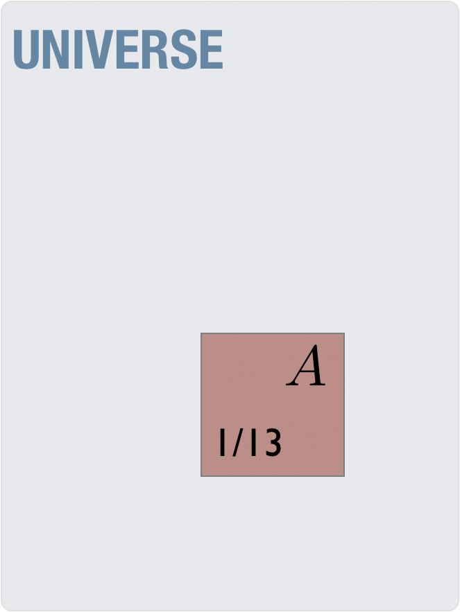
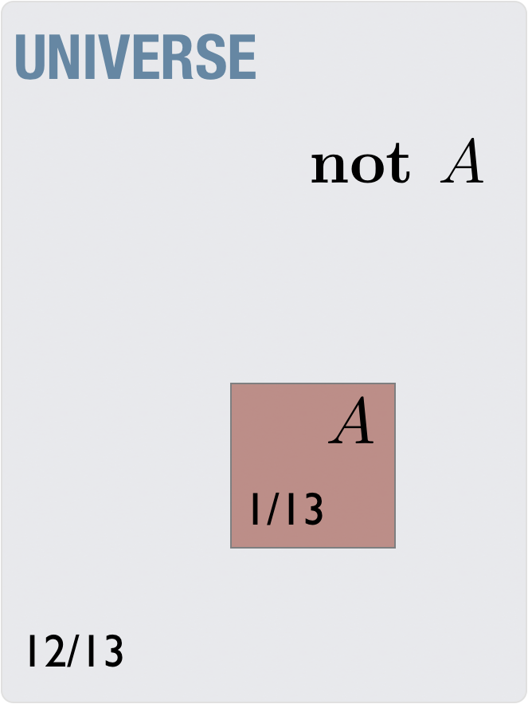
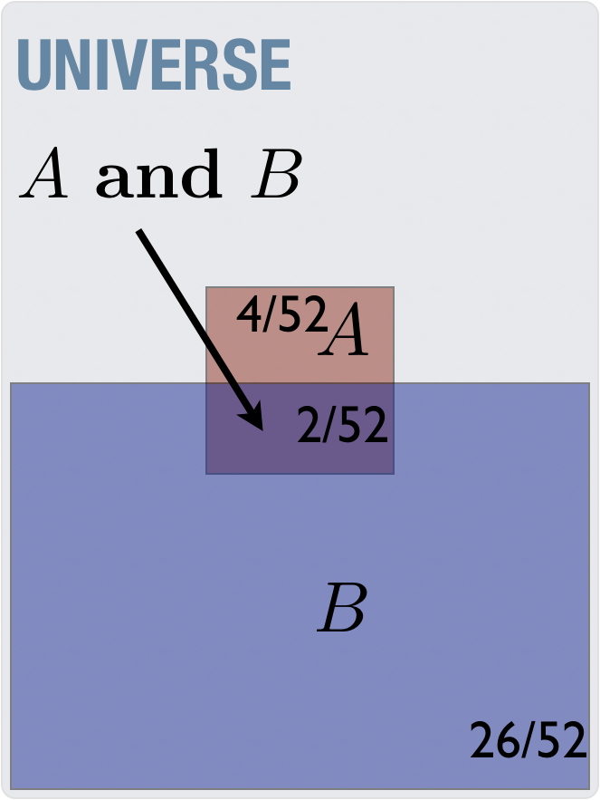
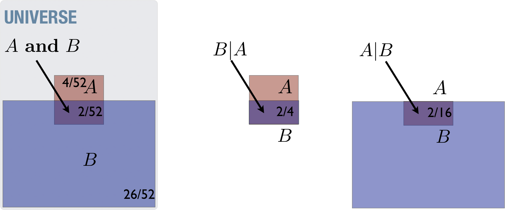
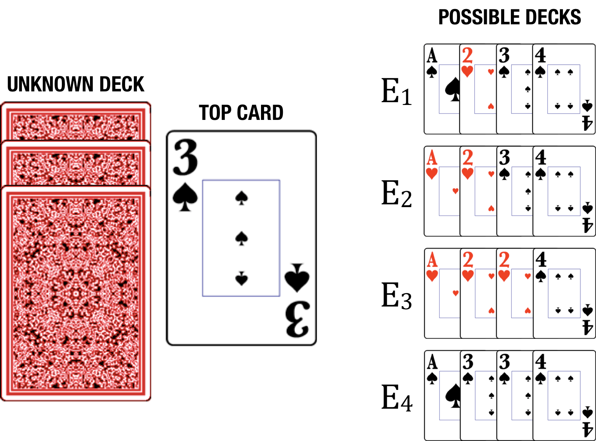
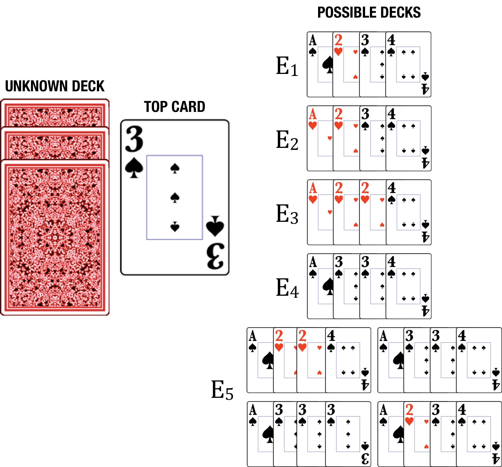
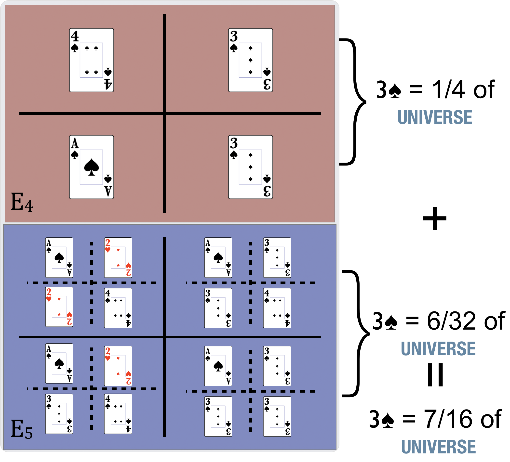

# Probability is not just about the math

When we speak about probability, we speak about a percentage chance (0%-100%) for something to happen, although we often write the percentage as a decimal number, between 0 and 1.  If the  probability of an event is 0 then it is the same as saying that *you are certain that the event will never happen*.  If the probability is 1 then _you are certain that it **will** happen_.  Life is full of uncertainty, so we assign a number somewhere between 0 and 1 to describe our state of knowledge of the certainty of an event. The probability that you will get struck by lightning sometime in your life is $p=0.0002$, or 1 out of 5000. Statistical inference is simply the inference in the presence of uncertainty.  We try to make the best decisions we can, given incomplete information.  

Pierre-Simon Laplace, who first formalized the mathematics of probability, spoke of an agent with perfect knowledge.  This agent, Laplace claimed, would not need probability at all.

> *We may regard the present state of the universe as the effect of its past and the cause of its future. An intellect which at a certain moment would know all forces that set nature in motion, and all positions of all items of which nature is composed, if this intellect were also vast enough to submit these data to analysis, it would embrace in a single formula the movements of the greatest bodies of the universe and those of the tiniest atom; for such an intellect nothing would be uncertain and the future just like the past would be present before its eyes.* [@laplace1825philosophical]

E.T. Jaynes describes it in much the same way.  He says that we label something "random" due to our ignorance of the system not to any intrinsic randomness.  He calls this labeling the mind-projection fallacy [@Jaynes2003], where you misattribute the unpredictable behavior of a system as a product of the system itself. A rolled die is following the laws of physics, deterministically, and detailed knowledge of the die, the roll, and the surface should allow you to predict 100% of the time what it will do.  We lack that knowledge, thus the behavior becomes unpredictable. We often then attribute that unpredictable behavior as a "random die", as if it were the die that contains the randomness and not our own state of knowledge.

### The basic rules of probability

For a complete description of the rules of probability, and their application in general statistical inference there are several books available, one of which from the present author [@Blais:2014aa].  We will need to establish a basic set of notation and mathematics in order to address the concepts.  This notation will in some cases make clear and condensed (due the the terseness of mathematics) much longer expositions of the same concepts in English.  In other cases, it will provide a systematic framework for exploring disparate problems, in order to see the connection to all of rational thought.  We begin by describing the rules of probability, and some of their consequences.  

When we write $P(A)$ the "$P$" stands for "probability" and "$A$" is some proposition or claim.  We will be in the habit of naming sentences or statements with a short-hand of a single letter, like $A \equiv$ "*I draw an Ace from a well-shuffled, typical 52-card deck of cards*"[^equiv].

[^equiv]: We use the symbol "$\equiv$" to denote a *definition*, not just the equality relationship denoted by the "=".

We then can talk about the probability of this statement being true with $P(A)$, which is a summary of "*the probability that if I draw a card from a well-shuffled, typical 52-card deck of cards that I will draw an Ace.*"  The shorthand allows us to write some general statements in a small amount of space.

Instead of using real-life examples to start, I prefer to use examples from simple card games.  Using playing cards has several distinct advantages:

1. most people are comfortable with the concept of uncertainty in card games
2. a deck of cards is a *small* system
3. the *probabilities* are a direct parallel with *fractions* of card counts, making the subject more intuitive
4. a deck of cards is amenable to pictures

#### Rule 1 (Definition rule):

The probability of a proposition or statement, e.g. $P(A)$,  is a number between 0 and 1, representing the strength of belief in a statement, $A$.  
$$
\begin{aligned}
P(A)=&0 \,\text{certainly false}\\
P(A)=&1 \,\text{certainly true}\\
0 <  P(A) < & 1  \,\text{degrees of belief}
\end{aligned}
$$

The following picture shows a way to visualize this, with a "Universe" of all possibilities and the subset, which is our particular statement as a fraction of the total.

{ width=200px }

Although this probability is *estimated* by the fraction of Aces in a deck of cards, whenever we write probabilities we are referring to a measure of the strength of one's belief in the statement.  Thus, when we write that $P(A)= 4/52 = 0.077$ this probability means that you believe it to be  unlikely — but not extremely unlikely — that you draw an Ace from a well-shuffled deck (see the Rough guide for the conversion of qualitative labels to probability values in  Table 1  at the end of the chapter).  This belief, as we will see, is not just a *guess* but is something arrived at through proper rational processes, or in other words, by adhering strictly to the rules of probability.

### A bit more about the deck-of-cards analogy

We are using the deck of cards to be analogous to the real world.  While there are things we know about the real world there is a lot of uncertainty as well, just like the uncertainty of the deck of cards.  We can gather evidence in the real world, to better know what the truth is, and analogously we can draw cards from the deck to better know what the properties of the deck is, i.e. is it well-shuffled, is it a standard 52-card deck or a deck of Tarot cards, etc…  As in the real world, we can propose *models* or simplified descriptions of what we think the deck is, and we can perform tests of these models by drawing from the deck and comparing to what we expect from the models.   The methods of science do this with nature itself, by arranging situations where the observations will possibly rule out some models in favor of others, so that we get closer to the truth.  The same rules of probability apply in all of these cases, but given the intuitive nature of a deck of cards, it is easier to see them applied in this simple system.

#### Rule 2 (Negation rule):

The negation rule states that a proposition is either true or its negation (i.e. direct opposite) is true.
$$
P(A) + P({\rm\bf not}\, A) = 1
$$

The following picture shows a universe of all possibilities and the subset ($A$) which is our particular statement as a fraction of the total, along with the *opposite* of this subset (**not** $A$) which  adds up to the total.

{width=200px}

In other words, either a statement is true or its negation is true.
$$
\begin{aligned}
A&\equiv\left[\,\text{``you will draw an Ace from a deck of cards''}\right. \\
P(A)+P(\mathbf{not}\, A)&=1 \\
\frac{1}{13} + \frac{12}{13} &=1
\end{aligned}
$$
means that you can be *certain* (i.e. probability equal to 1) that when you draw a card from a deck, it will either be an Ace or it won't be an Ace.  This all seems rather obvious, and you may be wondering why we even bring it up.  Surprisingly, this "*obvious*" property becomes a source of one of the most common logical fallacies - the either-or fallacy. 

Notice how this occurs.  The following is correct logical inference:
$$
\begin{aligned}
B&\equiv\left[\text{``a playing card drawn from a deck is black''}\right. \\
P(B)+P(\mathbf{not}\, B)&=1
\end{aligned}
$$
means that, if you draw a playing card from a deck, you can be *certain* that it is either black or it is not-black.  This is true no matter what kind of deck of cards you are dealing with, even if it contains no black cards!  The following, however, is *not* a correct logical inference:
$$
\begin{aligned}
B\equiv&\left[\text{"a playing card drawn from a deck is black"}\right. \\
R\equiv&\left[\text{"a playing card drawn from a deck is red"}\right. \\
P(B)+P(R)=&1 \leftarrow \text{this is incorrect}
\end{aligned}
$$
The key point here is that "not-black" is not the same as "red" except in those cases where you can be *certain* that there are only those two possibilities.  One has to be on the lookout for hidden possibilities - perhaps one has a *Five Crowns* deck which has green and yellow cards as well? Failure of imagination can easily lead to accidental either-or logical failures.  Statements like "You're either with us or against us!" (no third option?) and "If you don't take a stand against a political candidate then you must be supportive of her." (again, no other options?) serve as a reminder to recognize this lack of imagination on our part.

#### Rule 3 (Conjunction rule): 

The conjunction rule defines how we handle two propositions being true at the same time, relating them to the probabilities of the individual propositions *alone* and the probabilities of each one assuming the other is true, also called the *conditional* probability.  The latter probability captures how the two propositions are related.
$$
\begin{aligned}
P(A \,\mathbf{and}\, B) = P(B|A)P(A)
\end{aligned}
$$

which is the probability of two statements both being true, A **and** B.  We define a new symbol, $|$, which should be read as "given."  When there is information given, we call this probability *conditional* on that information.  We can represent the conjunction as the *overlap* in the following picture:

{width=200px}

The numbers in the picture are coming from the propositions $A\equiv$ "you will draw an Ace from a deck of cards" and $B\equiv$ "a playing card drawn from a deck is black"

The conditional statements are like restricting the universe to the small part of what you're "given" (i.e. what's on the right-hand side of the bar symbol, $|$).  For example, $P(A|B)$, is the probability of $A$ if you restrict your cases to those satisfying $B$ (see the right-hand rectangle in the following picture) and $P(B|A)$, is the probability of $B$ if you restrict your cases to those satisfying $A$ (see the middle rectangle in the picture):

{width=300px}

The conjunction rule in this case means that the probability of you drawing a black Ace is related to the probability of you drawing an Ace from a collection of black cards (i.e. "given that the card is black",  $P(A|B)$) and the probability that you will draw a black card at all ($P(B)$) or equivalently, the probability of you drawing a black card from a collection of Aces (i.e. "given that the card is an Ace", $P(B|A)$) and the probability that you will draw an Ace at all ($P(A)$).

Numerically we have 
$$
\begin{aligned}
P(A) &= \frac{4}{52}& \text{ (probability of Ace out of all cards)}\\
P(B) &= \frac{1}{2}& \text{ (probability of black out of all cards)}\\
P(A|B) &= \frac{2}{26}& \text{ (probability of Ace out of black cards)}\\
P(B|A) &= \frac{2}{4}& \text{ (probability of black out of Ace cards)}
\end{aligned}
$$
From which follows the probability of having a black Ace in two mathematically equivalent ways,
$$
\begin{aligned}
P(A\,\mathbf{and}\, B) &=P(A|B)P(B) = \frac{2}{26}\times \frac{1}{2} = \frac{1}{26}
\end{aligned}
$$
and
$$
\begin{aligned}
P(A\,\mathbf{and}\, B) &=P(B|A)P(A) = \frac{2}{4}\times \frac{4}{52} = \frac{1}{26}
\end{aligned}
$$
Mathematically, it can be seen that $P(A \,\mathbf{and}\, B)$ is always lower than $P(A)$ unless we are *certain* that the other statement, $B$, is true  — the conjunction of two things is inherently (and mathematically) less probable than the individual components.  Failure to recognize this leads to the *conjunction fallacy*.  The most common example given is as follows (from [https://en.wikipedia.org/wiki/Conjunction_fallacy](https://en.wikipedia.org/wiki/Conjunction_fallacy)),

> *Linda is 31 years old, single, outspoken, and very bright. She majored in philosophy. As a student, she was deeply concerned with issues of discrimination and social justice, and also participated in anti-nuclear demonstrations.*
>
> Which is more probable?
>
> 1. Linda is a bank teller.
> 2. Linda is a bank teller and is active in the feminist movement.

Most people lead towards (2), but the actual answer is (1) because the combination of two things (a bank teller *and* is a feminist) is a smaller subset and is thus less likely[^conjunctionenglish].

[^conjunctionenglish]: this may be partly due to English being sloppier than math.  In choices like the Linda problem, there may be an implied "and is *not* a feminist" in option (1) in common usage but is not strictly present.

There are a few points to be made about the approach we've been using so far, which become important in later examples.

- Notice how concise the description is — the math can summarize the relationship between several concepts with few words or symbols.  

- As we've seen, the conjunction of two things is inherently (and mathematically) less probable than the individual components, sometimes with unintuitive consequences.

- If there is more than one way to reason properly to an answer, those different ways must come to the same answer.  This is a good check to see that you are thinking properly when you see the same answers, but it is also a way to distinguish two methods that are in fact not equivalent even if they seem to be — they come to different answers.

- Two statements are considered *independent* if knowledge of one gives you no more information about the other.  In probabilistic terms, this means that $P(B|A)=P(B)$ — knowing $A$ is true doesn't make the probability of $B$ any more or less.  Flipping a coin a second time is still going to be 50-50 heads-tails whether you flipped a heads the first time or not.  Drawing a second card from the top of a deck is a little less likely to be a black card if you draw a black card on the first time — knowledge of previous cards drawn tells you information about the probabilities for the second.  Independence becomes important in the evaluation of evidence because it changes how evidence can be accumulated. 

- In the case of *independent* statements, the conjunction rule simplifies to

$$
P(A\,\mathbf{and}\,B) = P(A)\cdot P(B) \,\,\,\text{  (independent)}
$$

- The *general case* of the conjunction rule looks like

$$
\begin{aligned}
P(A\,\mathbf{and}\,B\,\mathbf{and}\,C\,\mathbf{and}\,D)=&P(A)\times P(B|A)\times P(C|A\,\mathbf{and}\,B)\times \\
&P(D|A\,\mathbf{and}\,B\,\mathbf{and}\,C)
\end{aligned}
$$

  

#### Rule 4 (Bayes' rule)

This rule is perhaps the most obtuse to see for the first time, but is by far the most important rule of them all, so it is worth the effort.  
$$
\begin{aligned}
P(A|B) =& \frac{P(B|A)P(A)}{P(B)}
\end{aligned}
$$
Mathematically, it is just a rewriting of the conjunction rule above.  Its deeper meaning can be seen when rewritten in a somewhat more elaborated form describing our belief in an explanation given some data,

$$\begin{aligned}
P({\rm explanation}|{\rm data})&=& \frac{P({\rm data}|{\rm explanation})P({\rm explanation})}{P({\rm data})}
\end{aligned}$$

where each term is described more fully as 

- $P({\rm explanation})$ —the probability the explanation is correct *prior* to seeing the data.  The term itself is often called the *prior*, and represents your beliefs before you see the data.  Typically, more complex explanations are less likely a-*prior*i than simpler ones.  I will use the term *model* in place of explanation in most of this book, but it means the same thing.
- $P({\rm explanation}|{\rm data})$ — the probability the explanation is correct *after* seeing the data (*a-posteriori*). The term itself is often called the *posterior* for this reason, and represents your updated beliefs once you have data.  Thus, Bayes' rule is a mathematical expression of *learning* from evidence.  
- $P({\rm data}|{\rm explanation})$ — the probability that the data can be explained with *this particular explanation*.  The term itself is often called the *likelihood*, and can be thought of as a measure of how well the explanation fits the data.  If the explanation fits the data well, this number will be high, for example.  If it fails to explain the data, this number will be low.  Although related to our final (*posterior*) belief, it is not equivalent.   An explanation that fits the data well may be very unlikely as our best explanation just because that explanation was extremely unlikely in the first place (i.e. before we saw the data, aka the *prior* was low). 
- $P({\rm data})$ — the total probability of the data, regardless of the explanation.  It is easiest to understand this term with an examples below.

Imagine we are playing a game with several small decks of cards, defined here:

- $E_1: A\spadesuit, 2\heartsuit, 3\spadesuit,4\spadesuit$
- $E_2: A\heartsuit, 2\heartsuit, 3\spadesuit, 4\spadesuit$
- $E_3: A\heartsuit,2\heartsuit, 2\heartsuit,4\spadesuit$
- $E_4: A\spadesuit,3\spadesuit, 3\spadesuit, 4\spadesuit$

Where $E$ is denoting a deck or, more generally, an *explanation* for the data we will collect by drawing cards.  In the game, someone has handed us one of the decks (i.e. $E_1$, $E_2$, $E_3$ or $E_4$) but we don't know at all which one it is. The analogy here is that the universe is set up with a set of rules that we are trying to determine.  Thus, deciding on which deck we are holding is analogous to deciding which universe we are actually in, given our observations of the universe.  In other words, providing an *explanation* of the data is really about determining which of the many possible universes we are in.

{width=400px}

We then draw the top card, observe that it is a $3\spadesuit$, and see if we can reason about which deck is likely to be the one we are holding.  We choose such a small, simple system because it is easy to intuit the answers without the math.  This intuition can provide a scaffold for understanding the mathematics, which can be used in more complex examples where one *doesn't* have a strong intuition.  It is therefore worth going through at least one example in detail.

To begin, we need to assign the probabilities of the four cases *prior* to the data.  Given total ignorance of which deck was chosen— we know that there are 4 possibilities but have no idea about anything more about the selection process —  we assign equal probabilities to the four cases[^equal]

$$\begin{aligned}
P(E_1)&=&1/4 \\
P(E_2)&=&1/4 \\
P(E_3)&=&1/4 \\
P(E_4)&=&1/4
\end{aligned}$$

[^equal]: not all cases will lead to equal probabilities of the outcomes, because we almost always have *some* knowledge to go on.

Note that in this example we know what cards are in each deck -- we know, for example, that there are no spades in $E_3$ -- we just don't know which deck we were given.   Here we describe our intuitions, with the mathematics in parallel below.  Since we drew a $3\spadesuit$, our intuition says that this should rule out $E_3$ altogether.  Further, it says $E_4$ should be more likely than the other remaining two because it contains the observed card, $3\spadesuit$, more than one time -- it is easier to get that particular card from the fourth deck than the others.

The mathematics would look like this

$$\begin{aligned}
P(E_1|3\spadesuit)=&\frac{P(3\spadesuit|E_1)P(E_1)}{P(3\spadesuit)}\begin{array}{c}\ \\\leftarrow\text{this term the same in all}\end{array}\\
P(E_2|3\spadesuit)=&\frac{P(3\spadesuit|E_2)P(E_2)}{P(3\spadesuit)}\\
P(E_3|3\spadesuit)=&\frac{P(3\spadesuit|E_3)P(E_3)}{P(3\spadesuit)}\\
P(E_3|3\spadesuit)=&\frac{P(3\spadesuit|E_4)P(E_4)}{P(3\spadesuit)}
\end{aligned}$$

where we already have

$$\begin{aligned}
P(E_1)=P(E_2)=P(E_3)=P(E_4)=1/4
\end{aligned}$$

Further, we have 

$$\begin{aligned}
P(3\spadesuit|E_1) = 1/4
\end{aligned}$$

because one card out of 4 in the first deck is the $3\spadesuit$.  Likewise, we have

$$\begin{aligned}
P(3\spadesuit|E_2) &= 1/4\\
P(3\spadesuit|E_3) &= 0 \\
P(3\spadesuit|E_4) &= 2/4 
\end{aligned}$$

Finally we have[^complicated]

[^complicated]: The reader might be thinking at this time, "why do we have to do all this?  Seems complicated!"  I address this shortly, so please bear with me.

$$\begin{aligned}
P(3\spadesuit) = 4/16
\end{aligned}$$

because there are four "$3\spadesuit$" cards out of all the 16 in the game.  Plugging these numbers into the above equations, and performing the arithmetic, we have
$$\begin{aligned}
P(E_1|3\spadesuit)&=\frac{(1/4)\times (1/4)}{(4/16)} = 1/4 \\
P(E_2|3\spadesuit)&=\frac{(1/4)\times (1/4)}{(4/16)} = 1/4 \\
P(E_3|3\spadesuit)&=\frac{(0)\times (1/4)}{(2/12)} = 0 \\
P(E_4|3\spadesuit)&=\frac{(2/4)\times (1/4)}{(4/16)} = 1/2 \\
\end{aligned}$$

which perfectly matches our intuition — $E3$ is certainly false, and $E_4$ is more likely than the other two.  Notice further that $P(3\spadesuit|E_1)$ is another way of saying "how well is the observation of a $3\spadesuit$ explained by the idea that we're holding the first deck?"  The entire process can then be thought of as updating our initial beliefs with the new evidence.  

> *Any process of reasoning, in any field whatsoever, is either consistent with this process of calculation or it is not rational.*

It is for this reason that we explore this process in such detail.

On another front, an alternate way to have calculated the shared bottom term, $P(3\spadesuit)$, is the following totally long-winded and complicated way

$$\begin{aligned}
P(3\spadesuit) =& P(3\spadesuit|E_1)P(E_1) + P(3\spadesuit|E_2)P(E_2)+ \\
&P(3\spadesuit|E_3)P(E_3)+ P(3\spadesuit|E_4)P(E_4)\\
=&(1/4)\times (1/4) + (1/4)\times (1/4) + (0)\times (1/3)+ (2/4)\times (1/4) \\
=& 4/16
\end{aligned}$$

Why would one write it in this seemingly over-complex fashion?  Because it makes it easier to say, in words, what this term is doing.  It is the sum of all of the probabilities for how well each explanation accounts for the data scaled by how likely that explanation was before seeing the data.  In other words, proper rational inference requires that you re-weight the strength of your beliefs in an explanation not just by how well that explanation describes your observations, but also by how intrinsically likely that explanation is before your observations and how well all of the *alternatives* perform on those same observations.  

{width=400px}

An observation can be very well explained by a particular explanation, but if it can be equivalently explained by other, simpler, explanations, then your belief in that more-complex  explanation may in fact *weaken* with the new observation (i.e. its probability could go down).

## On simplicity

Ockham's razor, which is the philosophical idea that simpler theories are preferred, is a consequence of Bayes' rule when comparing models of differing complexity [@jefferys1991sharpening].  We can see this by extending the card game example with a fifth possibility.  

{width=400px}

Instead of giving the specific cards in this deck, we are simply told

- $E_5:$ the deck can have anywhere from zero to three $3\spadesuit$, and enough other cards to make a total of four cards

This explanation of the game is what is called *plastic*^[In mathematical models, this is often referred to as having an *adjustable parameter*] - a value in the model that is not specified ahead of time, but can be *fit* to the data, and an optimum value found.  We could potentially think like this, "depending on the data, we may infer a different value for the number of $3\spadesuit$ in this deck.  It may be heavily loaded toward $3\spadesuit$, which would make $E_{5}$ explain the data very well; however it may have none, and not explain the data at all.  Clearly, once you observe a $3\spadesuit$, the "best" value for this deck is to have three of them out of the four cards - making it more likely than the previously best explanation, $E_4$, which only had two out of four."

However, this process of reasoning violates the laws of probability by not taking our uncertainty of this parameter (i.e. the number of $3\spadesuit$  in the deck) into account.  For simplicity, let's just consider the two decks in question, $E_4$ and $E_5$, and play the game with them (again, as before, drawing a $3\spadesuit$ from the top).

- $E_4$: $A\spadesuit$,$3\spadesuit$, $3\spadesuit$, $4\spadesuit$
- $E_5$: the deck can have anywhere from zero to three $3\spadesuit$, and enough other cards to make a total of four cards

 

We set up the calculation as before,

$$\begin{aligned}
P(E_4|3\spadesuit)&=&\frac{P(3\spadesuit|E_4)P(E_4)}{P(3\spadesuit)}\\
P(E_5|3\spadesuit)&=&\frac{P(3\spadesuit|E_5)P(E_5)}{P(3\spadesuit)}
\end{aligned}$$

We defer the calculation of the shared term, $P(3\spadesuit)$, and focus on the numerators of both calculations.[^numerators]  First the one for $E_4$ (and remember, we have only two decks here, so we'll have a prior of $P(E_4)=P(E_5)=1/2$),

[^numerators]: Once we have the numerators, we can add them up to get the shared term $P(3\spadesuit)$

$$\begin{aligned}
P(E_4|3\spadesuit)&\sim&P(3\spadesuit|E_4)P(E_4)\\
&=&(2/4)\times (1/2) = 1/4
\end{aligned}$$

Next with the $E_5$ deck,

$$
\begin{aligned}
P(E_5|3\spadesuit)&\sim P(3\spadesuit|E_5)P(E_5)\\
&=P(3\spadesuit|E_5)\times (1/2) \\
\end{aligned}
$$
where the term $P(3\spadesuit|E_5)$ is arrived at by breaking it into the four possibilities, e.g. from zero to three $3\spadesuit$.  Each of the possibilities (all equally likely, because we are given no other information) has the form of the fraction of $\spadesuit$ for that possibility times 1/4 because there are 4 total possibilities to consider, for example
$$
\begin{aligned}
P(3\spadesuit|E_5\text{with zero } 3\spadesuit s)P(\text{zero } 3\spadesuit s|E_5) =& \underbrace{(0/4)}_{\text{zero }\spadesuit s} \times (1/4) \\
P(3\spadesuit|E_5\text{with one } 3\spadesuit)P(\text{one } 3\spadesuit|E_5) =& \underbrace{(1/4)}_{\text{one }\spadesuit} \times (1/4)\\
\vdots &
\end{aligned}
$$

Doing the same for all the possibilities, we get for the $E_5$ numerator,

$$
\begin{aligned}
P(3\spadesuit|E_5)P(E_5) &=\left[(0/4)\times (1/4) + (1/4)\times (1/4) +  \right. \\
&\left. (2/4)\times (1/4) +  (3/4)\times (1/4)\right]\times (1/2) \\
&=3/16
\end{aligned}
$$

Finally, we can get the shared term, 

$$\begin{aligned}
P(3\spadesuit)= 1/4 + 3/16 = 7/16
\end{aligned}$$

and the probabilities of each of the decks, given the observation of a $P(3\spadesuit)$,

$$\begin{aligned}
P(E_4|3\spadesuit)&=&\frac{1/4}{7/16} = 4/7\\
P(E_5|3\spadesuit)&=&\frac{3/16}{7/16} = 3/7
\end{aligned}$$

This means that, although $E_5$ contains the *possibility* of a better fit to the data, it is less *probable* because it has a flexible parameter that is unspecified *before* the data.  Even more interesting, is that $E_5$ actually *contains* $E_4$ as a possibility!  In other words, if you have an explanation which is not specific but can adjust to the data only after seeing it, there is a danger in accepting that explanation over one that is specific and doesn't change its prediction after the data.  The proper use of the rules of probability help guard against this danger.  In religious contexts, an example of this happens when addressing the efficacy of prayer.  Someone might reason as follows, "if the prayer works then God chose to act, otherwise God had a reason to withhold action".  This is a poor explanation, because it is not specific and adjusts to the data only after the fact -- only couldn't make a prediction with this model of the world.  

When we prefer a "simpler" model with Ockham's razor, simpler means *fewer  adjustable parameters*.  It also means that the predictions are both *specific* and not *overly plastic*. For example, a hypothesis which is consistent with the observed data, but also would be consistent if the data were the opposite would be overly plastic.  An example of an infinitely plastic "explanation" is "*magic did it*."  Because it can "explain" anything (given that it is consistent with any possible observation), it thus explains nothing.  Conspiracy theorists suffer from this problem, because any counter-evidence provided get lumped into the conspiracy.  If you claim that we staged the moon landing, and someone provides photographs of the astronauts on the moon, then you can just say that the astronaut and the photographer are "in on the conspiracy" -- the model gets adjusted after the fact and is *overly plastic*.

Notice also that *simpler* does not necessarily mean having fewer parts.  The explanation $E_5$ actually has fewer parts than $E_4$ because I don't specify any of the other cards, only the possible number of $3\spadesuit$.  The complexity of the explanation  comes from its flexibility.

## On belief, knowledge, and proof

Clearly the terms belief, knowledge, and proof are related but it is the framework of probability that helps us be specific about their differences.  We can summarize the situation with the following,

- *Belief* is measured by probability.  Higher probability is equivalent to stronger belief, and likewise, lower probability is equivalent to weaker belief.
- *Knowledge* is a subset of belief, described more specifically below.
- *Proof* refers specifically to the result of a *deductive* process.  In this process, one starts with some (given) axioms, and can demonstrate *with certainty* (i.e. prove) a number of theorems (i.e direct consequences) from those axioms.  Thus, the word proof should only be used in situations involving *certainty*, or in other words, probabilities of exactly 1 or exactly 0 only.

### Belief

> We say we believe a proposition $A$ when $P(A)>0.5$.  We say we believe *strongly* in a proposition $A$ when $P(A)>0.95$ or some other, somewhat arbitrary, high number.  The strength of a belief is a *scale* measured by the probability assigned to that proposition.

Everything we have covered so far in this book relates to belief.  Notice that someone can have a *false* belief, if the information they are provided is incorrect.  If we want to believe as many true things and as few false things as possible then we should look for ways to test our beliefs and challenge the information we are given.  Belief, as used here, is different from *opinion*.  When we use the word *opinion* we can simply mean *preference* (e.g. I like vanilla more than chocolate) which is not a belief.  However I can also say I have an *opinion* about whether a political candidate is being honest, which is a usage equivalent to *belief* as long as the *opinion* is based on evidence and not just preference.  

### Knowledge

What is knowledge?  Plato gave the following definition of knowledge:

> Knowledge is justified true belief. [@fine2003plato]

This is an unsatisfying definition because, it seems, in order to justifiably label anything as *knowledge* with this definition we'd need to be able to independently determine that the statement is true. This presupposes that there is some "outside" knowledge, but we have no access to that.  I believe there is likely to be a truth to be known, but that we can never truly know what it is for certain — but this is not a problem. It is a red herring to bring up 100% certainty for knowledge, because it is never achievable, and isn't what we practically call knowledge. I prefer a definition inspired by Stephen J Gould:^[In this way, knowledge is a subset of belief.]

> In science, '*fact*' can only mean confirmed to such a degree that it would be perverse to withhold provisional assent. `I suppose that apples might start to rise tomorrow, but the possibility does not merit equal time in physics classrooms.' [@gould1981evolution]

Where it says "fact," read "knowledge."  Where it says "science" read "life."  The fact, or knowledge, that the Sun rises in the east and sets in the west is not due to a formal *proof* that this is always true, or will continue indefinitely into the future.  It is an admission that the probability is so outrageously high, given the evidence of every other sun rise and sun set observed, and the further confirmation of models of the solar system, that it would be "perverse to withhold provisional assent."  We accept the claim as a practical matter, despite not being 100% certain, because of the overwhelming probabilities.  This we call knowledge.  It is thus never a problem to admit lack of certainty in knowledge, and it can be seen as an obvious diversion if anyone tries to argue in a manner that suggests it's a problem.

Mathematically, we might write it as the probability of proposition "$A$" is very close to certain, or $P(A)>0.9999 \approx 1$ where "$\approx$" means *approximately*.  Notice that we don't need 100% certainty to claim knowledge, and that it is possible for the "knowledge" to be wrong (although, by definition, it is highly unlikely for this to be the case).  

We can ask the question, how did we come to this knowledge?  The answer is simply, by applying the rules of probability!  According to Bayes' rule, we update our probabilities given the evidence.  This can lead us to approach, but never equal, probability of 1.  We can approach, but never achieve, complete certainty of any claim.  Rationality only insists that we apply the rules of probability systematically. 

### Proof

Do *proof* and *evidence* mean the same thing?  No, they don't.  There are two primary processes for rational inference — *deductive* and *inductive*.  In *deductive* reasoning, one starts with some (given) axioms, and can demonstrate *with certainty* (i.e. prove) a number of theorems (i.e direct consequences) from those axioms.  In *inductive* reasoning, one presents evidence or data which makes certain models either more or less likely — never to absolute certainty.  Thus, the word "*proof*" should only be used in situations involving *certainty*, derived from axioms with logic.  In this way, *deductive* reasoning is a subset of *inductive* for those cases where the probabilities are *exactly* 1 or *exactly* 0.  *Induction* is just another name for the application of the rules of probability, so we have been doing that from the beginning of the book.  

I realize that I'm being pedantic here because in common speech we use the word "proof" a little more loosely.  We speak about "scientific proof" or "I won't believe this without proof".  However, it is important to be specific about one means here and I will insist though this book that the word "proof" be used only in the more restrictive sense.  Everything else is just probabilities approaching proof.  As a result, we have the following maxim,

> *Proof* does not exist in science, only in math and philosophy.

The only place you can have proof is where you have *axioms* (i.e. unprovable statements), and can then *prove* a number of consequences of those axioms. We can prove, for example, that the sum of the angles of a triangle is 180 degrees, if we start with the Euclidean axioms of geometry. Science doesn't have axioms, and thus there are no proofs - there is only evidence. We sometimes hear the term "proven scientifically," even from people who should know better.[^carrier]

[^carrier]: An example of someone who should know better is Richard Carrier in his ["Is Philosophy Stupid" talk](http://www.youtube.com/watch?v=YLvWz9GQ3PQ)., his [books](http://www.amazon.com/Proving-History-Bayess-Theorem-Historical/dp/1616145595), and his [articles](http://infidels.org/library/modern/richard_carrier/theory.html).

As it applies to science, it has the following consequence

> All of the evidence in the universe cannot bring the probability of a
> scientific claim to certainty.

To see this directly, imagine we have two (and only two) hypotheses for the earth - flat earth and round earth. We can write Bayes' rule for the probability of each given the data. Note that these data includes things like the experience of airplane flight, Magellan's trip, pictures from space - all of which could be faked! The flat earth hypothesis is not *logically* impossible, it's just been overwhelmed by the evidence.

$$\begin{aligned}
P({\rm round}|{\rm data}) &=& \frac{P({\rm data}|{\rm round})P({\rm round})}{P({\rm data}|{\rm flat})P({\rm flat})+P({\rm data}|{\rm round})P({\rm round})}\\\\
P({\rm flat}|{\rm data}) &=& \frac{P({\rm data}|{\rm flat})P({\rm flat})}{P({\rm data}|{\rm flat})P({\rm flat})+P({\rm data}|{\rm round})P({\rm round})} 
\end{aligned}$$

Notice that, no matter how well the round earth hypothesis explains the data (i.e. $P({\rm data}|{\rm round})\approx 1$) and how unlikely you believe it is that the Earth is flat even *before* the data, (i.e. $P({\rm flat})\ll 1$) as long as there is some *possible* (even if seriously contrived) way to explain the data with the flat earth hypothesis (i.e. $P({\rm data}|{\rm flat}) \neq 0$) it is *mathematically impossible* to make the round earth hypothesis certain. All of the terms in both equations above are greater than 0 and less than 1 and thus the round-earth model isn't 100% certain (i.e.$P({\rm round}|{\rm data})< 1$)

This does not mean that we can't be *confident* of claims, only that we cannot have *absolute certainty of anything* in science (and therefore, in life in general). Anyone who doesn't understand that does not understand science.

For it to be *reasonable to believe in something*, it must rise to a level of probability that you would label it as *belief*.  Does this ever happen, or should this ever happen, with untrue things?  Certainly.  Here are a few that come to mind.

- the world is flat - as long as you are constrained to not live near the shore, or see a lunar eclipse
- life is designed - before the advent of Darwin's theory of natural selection
- the Sun, and the stars, all go around the Earth - until the maturation of astronomy and physics

In each of these cases, *at the time* there was in fact strong evidence for the (false) claims, and against the counter claims making it reasonable to believe them.  It is no longer reasonable to believe these claims - the process of reason forces one to adjust the probabilities of the hypotheses given new evidence, and to discard those hypotheses that become too improbable.

## An example of independence

The nature of independence comes up in many places so it is important to understand how it can affect inference.   Recall that two statements are considered *independent* if knowledge of one gives you no more information about the other.  In probabilistic terms, this means that $P(B|A)=P(B)$ — knowing $A$ is true doesn't make the probability of $B$ any more or less.  In the case of cards, if I constantly reshuffle the deck after each draw then knowing one card will not help you with the next.  

I can easily make certain cards more or less likely by changing the process of drawing.  If I always place cards the I draw from the top of the deck back at the bottom of the deck, then knowing I've drawn two Aces so far makes the drawing of Aces *less likely* in future draws.  If however I place the cards back near the top of the deck (e.g. throwing them roughly into a pile that I draw from), then knowing I've drawn two Aces so far makes the drawing of Aces *more likely* in future draws. 

If you are assuming (for simplicity) that information you're getting from two different people is *independent* and it turns out that it isn't, then you will not reach proper conclusions.  It might be that the information is less reliable than you thought — that the second person only heard the information from the first, so you're effectively getting it from one person.  The equations would look like (focussing on the numerator of Bayes' Rule)
$$
\begin{aligned}
P(\text{claim}|A\,\mathbf{and}\, B) &\sim P(A\,\mathbf{and}\, B|\text{claim}) \\
&=P(A|\text{claim})P(B|A,\text{claim})
\end{aligned}
$$
The key part is $P(B|A,\text{claim})$ — how likely is the testimony from $B$ given the testimony from $A$? If it is independent, then one gains relevant information from the testimony.  If $B$ is parroting $A$, then this term is nearly $1$ and you will effectively only have $P(A|\text{claim})$.  If $B$ typically avoids agreeing with $A$, and has heard $A$ giving the testimony, then the probabilities are shifted in the opposite direction.  One can see that it becomes critical to know whether the parts of the process that provided your evidence are all independent.  

Scientists design experiments to make sure that the evidence is as informative as it can be — that two measurements of the same thing giving the same answer are doing so not because they correlate but because they independently came to the same answer so we can be confident in it.

## Lessons from probability

The mathematics of probability theory is the gold standard for all statistical inference.  It structures all inference in a systematic fashion.  However, it can be used without doing any calculations, as a guide to qualitative inference.  Some of the lessons that are consequences of probability theory are listed here, and will be noted throughout this text in various examples.

- Confidence in a claim should scale with the evidence for that claim - the more evidence the higher confidence.
- Ockham's razor, which is the philosophical idea that simpler theories are preferred, is a consequence of Bayes' Rule when comparing models of differing complexity that explain the data equally.
- A complex model must explain the data *even better* than a simple model to be preferred.
- Simpler means *fewer adjustable parameters* not fewer parameters or parts.
- Simpler also means that the predictions are both *specific* and not *overly plastic*. For example, a hypothesis that is consistent with the observed data, but can also be consistent if the data were the opposite, would be overly plastic.
- Your inference is only as good as the hypotheses (i.e. models) that you consider.
- Extraordinary claims require extraordinary evidence. [@sagandemon]
- It is better to explicitly display your assumptions rather than implicitly hold them.
- It is a *good thing* to update your beliefs when you receive new information.
- Not all uncertainties are the same.

There is not a universal agreement for the translation of numerical probability values to qualitative terms in English (i.e. highly unlikely, somewhat unlikely, etc...).  One rough guide is shown in [Table 1 ](#table-1).  I will be following this convention throughout the book, but realize that the specific probability distinctions are a bit arbitrary.

#### Table 1

|         term         |    probability     |
| :------------------: | :----------------: |
| virtually impossible |    1/1,000,000     |
|  extremely unlikely  | 0.01 (i.e. 1/100)  |
|    very unlikely     |  0.05 (i.e. 1/20)  |
|       unlikely       |   0.2 (i.e. 1/5)   |
|  slightly unlikely   |   0.4 (i.e. 2/5)   |
|      even odds       |  0.5 (i.e. 50-50)  |
|   slightly likely    |   0.6 (i.e. 3/5)   |
|        likely        |   0.8 (i.e. 4/5)   |
|     very likely      | 0.95 (i.e. 19/20)  |
|   extremely likely   | 0.99 (i.e. 99/100) |
|  virtually certain   | 999,999/1,000,000  |

Table: Rough guide for the conversion of qualitative labels to probability values.

