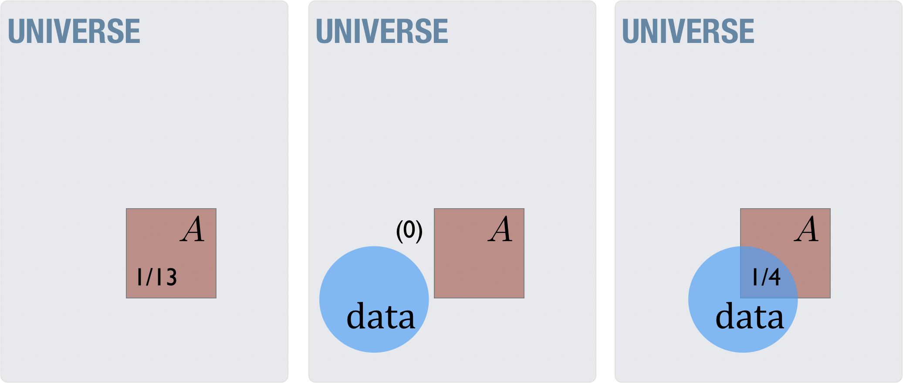

# Belief and evidence

## Belief, non-belief, and disbelief

Moving beyond the cards analogy, imagine that we have someone claiming

> There are an even number of stars in the Galaxy.

how should one evaluate this claim?  Let's see what we know. 

1. There are trillions of stars in the Galaxy
2. By Rule 2 (Negation rule) the actual number of stars *must* be either even or "not-even"
3. The property of numbers themselves states that if a whole number is "not-even" then it must be odd — there are no alternatives
4. Given no obvious way to estimate the number of stars within an accuracy of 2 stars, we assign equal probabilities to each,

$$
\begin{aligned}
P(\rm even) &= 0.5 \\
P(\rm odd) &= 0.5
\end{aligned}
$$

With no more information than this, I would not believe the original claim.  Anyone making the strong claim that, for example, $P({\rm even})>0.95$ would have to present compelling evidence.  Note, however, that me saying, "I don't believe your claim" or "I am not convinced by the evidence you have given" does **not** mean that I think the claim is false.  Put another way, if we're having a conversation and it goes like:

* Bob: I think there are an even number of stars in the Galaxy.
* Me: I don't believe you can support that claim.
* Bob: So you think there is an *odd* number of stars in the Galaxy?  (note to reader: see the either-or fallacy here?)
* Me: No, I have no idea whether there is an even or odd number - it seems like a coin flip to me. I just don't believe someone can make the positive claim that there is an even number.  I also don't believe someone can make the positive claim that there is an odd number.  

Put another way, in a court of law there is a difference between a verdict of "not-guilty" and one of "innocent."  Juries are only allowed to give a verdict of "not-guilty" — that the prosecution (i.e. the one making the positive claim) has not given persuading evidence to convict.  

Given that believing a claim, not-believing the claim, and believing the opposite of the claim are all distinct perspectives one can have for any claim and given further that these can get confusing when you talk about them, it is no wonder that people get hung up on definitions!  Seen in terms of math, we can at least get a little bit of clarity.  

Given the claim

> There are an even number of stars in the Galaxy.

we can have the following perspectives (and more!):

* $P(\text{even})>0.95$ (which implies $P(\text{odd})<0.05$) — I am confident the claim is true
* $P(\text{even}) \approx 0.7$ (which implies $P(\text{odd}) \approx 0.3$) — I believe the claim, but not strongly
* $P(\text{even}) \approx 0.5$ (which implies $P(\text{odd}) \approx 0.5$) — I have no idea whether the claim is true, but I disagree with anyone who is confident the claim is true or false
* $P(\text{even}) \approx 0.3$ (which implies $P(\text{odd}) \approx 0.7$) — I believe the claim is *false*, but not strongly
* $P(\text{even})<0.05$ (which implies $P(\text{odd})>0.95$) — I am confident the claim is *false*

Using these simple numbers it becomes easier to separate the different viewpoints, and to admit others.  

### Theism and atheism

In religious circles, the first claim we look at is

> G: God exists.

In shorthand we'll call this claim "$G$," so we can talk about the probability of God existing as $P(G)$ without having to write many words.  Those who are religious generally would set a high value for $P(G)$.  We would call them *theists*. In the section On Belief, Knowledge, and Proof we define knowledge as a high-probability belief.  *Theism* typically refers to *belief* (of any magnitude) , *gnosticism* refers to knowledge.  Thus, you can be a *gnostic theist*.

In parallel with the stars example above, we can have the following definitions:

- $P(G)>0.95$ — I am confident God exists.  I am a *gnostic theist*.
- $P(G) \approx 0.7$ — I believe that God exists claim, but not strongly.  I am an *agnostic theist*.
- $P(G) \approx 0.5$ — I am unconvinced by anyone who is confident God exists or God doesn't exist.  I am an *agnostic atheist* or for an *atheist*.
- $P(G) \approx 0.3$ — I believe that God *doesn't* exist, but not strongly. I am an *agnostic anti-theist*.
- $P(G)<0.05$ — I am confident that God *doesn't* exist. I am an *gnostic anti-theist*.

### A warning about labels

Too many discussions get hung up on labels.  Some insist that *atheism* is the lack of a belief, that atheists are simply not convinced by the positive claim.  Others use the same term to denote the *belief* that no God exists.  We can see that these are different uses of the same term "*atheism*," and if we are to make any headway in discussions we should either agree to use the same labels for the same things or dispatch with the labels and talk directly about claims and their probability.  Otherwise, everything is so ambiguous that the discussion falls apart.

For myself, when I use the term *atheist* I am referring to someone who doesn't believe in a God - that they are not convinced by the positive claim.  I reserve the use of the term *anti-theist* for the one who promotes the positive claim that God does not exist.  At no point, for any of these claims, is anyone 100% certain of their side.  That is too high a bar to attain and is not useful.  As a result, to counter a claim with "you're not 100% sure, are you?" is not an actual argument because no one — neither theist nor atheist — is claiming surety.

### Claims and definitions

When we go back to the original theistic claim,

> $G$: God exists.

we immediately run into the problem of definitions.  What do these words mean?   Probability theory only works for *well-defined* statements.  I can't talk about $P(\text{grue exists})$ without knowing what a *grue* is.  Further, when speaking about potentially supernatural things, even the word "*exists*" has to be examined — what does it mean to "exist" if you might not be talking about energy, matter, and other things that we can directly measure?  In what way do concepts like the number "2" or "liberty" exist?  I'm not going to explore this much, but we need to make sure that our probability assignments don't accidentally shift under ill-defined terms in the discussion.

Even with the claim that God exists, people have widely varying beliefs concerning the specifics.  The following provides some of the common terminology which will help the discussion.

* *theism* — the belief in one or more gods, which includes
  * *monotheism* — the belief in one God (e.g.  Judaism, Christianity, Islam)
  * *polytheism* — the belief in many gods (e.g. early Judaism, modern Hinduism, Cthulhu cults)
* *deism* — the belief in a creator that does not currently act in the universe
* *pantheism* — the belief that God is equivalent to Nature (e.g. Spinozism, some Wicca)
* *classical theism* — a form of *monotheism* which further states that the one God is the all-powerful, all-knowing, creator of the universe beyond space and time.

There are several reasons why these terms are helpful to us.  When setting up the evidence for God, both Bayes' rule and the Conjunction rule require spelling out all of the alternatives.  To avoid either-or fallacies one must be vigilant to know these various alternatives.  One also has to know what any particular argument or case is trying to present.  An apologist might have in mind that they are presenting evidence for the Christian God, but the actual evidence they are using could apply to many others, or even to the nearly empty concept of deism.  Keeping this in mind helps us avoid logical fallacies.

## Evidence

### What is evidence?

One definition of evidence for a claim is any data which makes the posterior probability of a claim higher than the prior.  Something like,
$$
P(A|\text{data}) > P(A)
$$

When does this happen?  

{width=400px}

We can see it that, of all of the possible events in the universe, $A$ occupies a small fraction.  However once we observe data then we are restricting the number of events to those that are consistent with those observations so the fraction occupied by $A$ can be larger or smaller, depending on the data and the claim.

Unfortunately, it can sometimes occur that people will use the shorthand "there is no evidence for X" when what they really mean is "there is not good evidence for X" or "not sufficient evidence."  The different is in magnitude.  "No evidence" would mean that there is no data which would make the probability of the claim go up — even by a minuscule amount.  "Not sufficient evidence" would mean that the data may increase the probability of the claim, but not up to the level of belief, so
$$
P(A|\text{data}) < 0.5
$$

Although a bit shorter and punchier, the term "*belief without evidence*" is misleading, even if you know you are focussing on the probability side of the analysis.  The more honest phrase would be "*belief without <u>sufficient</u> evidence*." When people say there is no evidence for something (like God, UFOs, astrology, psychic phenomena, etc…), they really mean that there is terrible evidence for something.  Even in the case of something so poorly supported as astrology, there is *some* evidence for its claims - the probability is not *zero*.  It may be very small, but one could imagine evidence (in principle) that would convince you, which means that the probability is indeed non-zero. The exaggerated, more simple, phrase of "*belief without evidence*" is counterproductive, especially when the more accurate phrase, "*belief without <u>sufficient</u> evidence*," is nearly as simple. 

### Evidence in the sciences

In the sciences, one is always comparing multiple claims or *models*, and constructing experiments to distinguish one model from another.  Experiments may not be "in the lab."  They may refer to computer simulations or methods of observation like measuring wavelengths of light coming from stars even if you can't bring stars into the lab.  The goal of the analysis is to take, say, two models $M_1$ and $M_2$ and to find scenarios where we can discern which ones to trust.  This is done by *falsification* or *disconfirmation* — showing that one of the models is *unlikely* — not by confirming one of the models.  Why is that?  Confirmation of a model would be to look for data which is likely if the model is true, or $P(\text{data}|M_1)$ is high.  However, what we really want to have is data which makes the *model* likely, or $P(M_1|\text{data})$ is high.  In order to do that we apply Bayes' Rule,
$$
\begin{aligned}
P(M_1|\text{data}) &=\frac{P(\text{data}|M_1) P(M_1)}{P(\text{data}|M_1) P(M_1)+P(\text{data}|M_2) P(M_2)}
\end{aligned}
$$
if we simplify with equal *priors*, $P(M_1)=P(M_2)=1/2$,
$$
\begin{aligned}
P(M_1|\text{data}) &=\frac{P(\text{data}|M_1)}{P(\text{data}|M_1)+P(\text{data}|M_2)}
\end{aligned}
$$
we will notice that the only way to have the *posterior*, i.e. $P(M_1|\text{data})$, to be high is to both have the model confirmed, i.e. $P(\text{data}|M_1)$ is high, but also the alternate model *disconfirmed*, i.e. $P(\text{data}|M_2)$ is low.  Otherwise, if we don't disconfirm alternatives we can not demonstrate any confidence in the model.  

Because of this, we can never be confident in a claim or model that is not able to be — in theory — falsified.  Invisible dragons that elude detection [@sagandemon] cannot be used to explain anything because there is not any way that one could — even in principle — show it to be false.  Another way to put it, these unfalsifiable claims are consistent with *every* possible experiment.

### Burden of proof

Although I refrain from using the word "proof" in a discussion of evidence, choosing only to use it in the cases of *absolute* certainty (e.g. geometrical proofs, etc…), the term "burden of proof" refers to the status of someone making an argument to support a claim.  The person making the *positive claim* is the one that is required to support it.  In the Section [Belief, Non-Belief, and
Disbelief] the person making the positive claim  "there are an even number of stars" must bring the evidence to support it — they have what is called the "burden of proof."   The person not convinced by the claim need not bring evidence — they are just not convinced the positive claim — and thus do not have the "burden of proof."

Establishing who has the burden of proof is critical in any argument, because it establishes where the evidence must come from.  A common mistake made by someone making the positive claim is to try to put the burden of proof on the other person, asking for a justification for the negative claim where one is not needed.  What makes the situation more complicated is that most claims have multiple components, so an individual person can have  positive, negative, and indifferent perspectives on the claims.  One can be simultaneously indifferent to the generic claim of a deistic creator, not be convinced of theistic claims, and actively disbelieve in classical theistic claims.  It is therefore advantageous to break up complex claims into a collection of simple claims and tackle one simple claim at a time.

Technically, "burden of proof" is only required in a court of law, it is still important to recognize that it applies to any form of logical argument.  Mostly it is important to be clear about what is specifically being claimed and what evidence there can be for that specific claim.  Much energy is often wasted arguing for an ill-defined claim.

### Utility - probability and action

Probability relates to belief, a measure of state of knowledge about a claim or set of claims.  We can use the mathematics of probability to determine the most likely claim, and use it to inform our actions, but it isn't enough to truly determine the best course of action.  For that, we need to extend the mathematics to include the notion of *utility*, an extension commonly referred to as *decision theory*.  Because faith seems to involve action or potential actions, it will need to be formulated in this way.  

Decision theory uses the idea of expected value to aid in making decisions, defined as [@Wikipedia:2015aa]

> The idea of expected value is that, when faced with a number of actions, each of which could give rise to more than one possible outcome with different probabilities, the rational procedure is to identify all possible outcomes, determine their values (positive or negative) and the probabilities that will result from each course of action, and multiply the two to give an expected value. The action to be chosen should be the one that gives rise to the highest total expected value.

The utility values, costs and benefits, could be written in monetary terms, but need not.  One needs only to have a scale to represent how good or bad an outcome is.  The total expected value, also called the  average utility, is just the sum of the individual costs and benefits associated with possible outcomes, weighted by their probability - more likely outcomes are weighted more than less likely ones.  An example will help.

The example here is called the "farmer's dilemma" [@jordaan2005decisions], concerns a farmer who can plant one of three crops (labeled $A$, $B$, and  and $C$) with the possibility of three different environments out of the farmer's control, *perfect weather*,*fair weather*, and *bad weather*.  Each of the three crops fare differently in different weather, and thus provide different costs and benefits to the farmer depending on the environment.  Crop $A$, for example, does very well in good weather but very badly in bad, whereas crop $C$ doesn't do as well but is more consistent, with crop $B$ in between.  This can be summarized by the following table of utilities showing benefits (positive) and costs (negative) for each possible combination:

|              | perfect weather | fair weather | bad weather |
| ------------ | :-------------: | :----------: | :---------: |
| plant crop A |       11        |      1       |     -3      |
| plant crop B |        7        |      5       |      0      |
| plant crop C |        2        |      2       |      2      |

Any decision the farmer makes must include the probabilities (his state of knowledge) of the weather environments.  At the extremes, it is easy to see this.  If perfect weather is nearly guaranteed, for example, then planting crop $A$ is of course the best option, whereas if bad weather is guaranteed, then planting crop $C$ is the best.  How does one handle the decision away from the extremes?  This is done by asking, what is the average utility (benefit or cost) for each action, and then choosing the action which maximizes this.  Imagine that the farmer consults a meteorologist, and they determine the following probabilities for the weather environment

$$
\begin{aligned}
P(\text{perfect weather})&=0.1 \\
P(\text{fair weather})&=0.5 \\
P(\text{bad weather})&=0.4
\end{aligned}
$$

The average utility[^average] for each action is simply the sum of the probabilities of each environment times the utility for that environment given the action, such as

$$
\begin{aligned}
\langle U_A \rangle =& P(\text{perfect weather})\times {\rm U}(\text{perfect weather}|\text{plant crop $A$}) + \\
& P(\text{fair weather})\times {\rm U}(\text{fair weather}|\text{plant crop $A$}) + \\
& P(\text{bad weather})\times {\rm U}(\text{bad weather}|\text{plant crop $A$}) \\
=& 0.1 \times 11 + 0.5 \times 1 + 0.4\times (-3) = 0.4
\end{aligned}
$$

[^average]: Average, or expected, value of a variable $U$ is denoted with angle brackets, $\langle U \rangle$.

Performing the same calculation for all of the actions yields,
$$
\begin{aligned}
\langle U_A \rangle &= 0.1 \times 11 + 0.5 \times 1 + 0.4\times (-3) = 0.4 \\
\langle U_B \rangle &= 0.1 \times 7 + 0.5 \times 5 + 0.4\times 0 = 3.2 \\
\langle U_C \rangle &= 0.1 \times 2 + 0.5 \times 2 + 0.4\times 2 = 2.0
\end{aligned}
$$
and the best action would be planting crop $B$, because it has the highest expected utility.

The primary point about this process that is relevant to our discussion of faith is that the process involves two separate entities - the probability of various states and the value those states are to us given our actions.  This maps directly to the concepts of *belief* and *trust*, respectively.  One can focus on each one individually, but it is the combination that is important.  

Although there are cases where the average utility is a bad guide, it is a very useful framework to structure a problem.  It should be noted that *utility* does not need to be restricted to money, but can include things like comfort and discomfort.  For example, someone could be *risk averse*, which means that they put a utility on some psychological comfort at the expense of some monetary loss.  Thus the utility value would combine both.  

