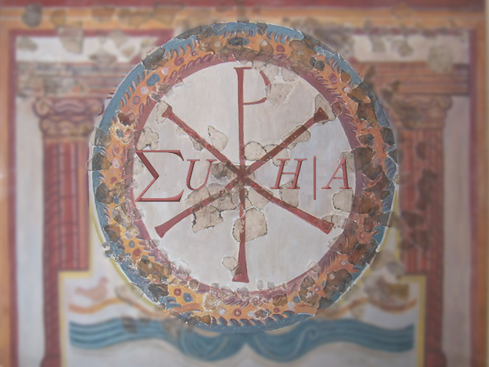
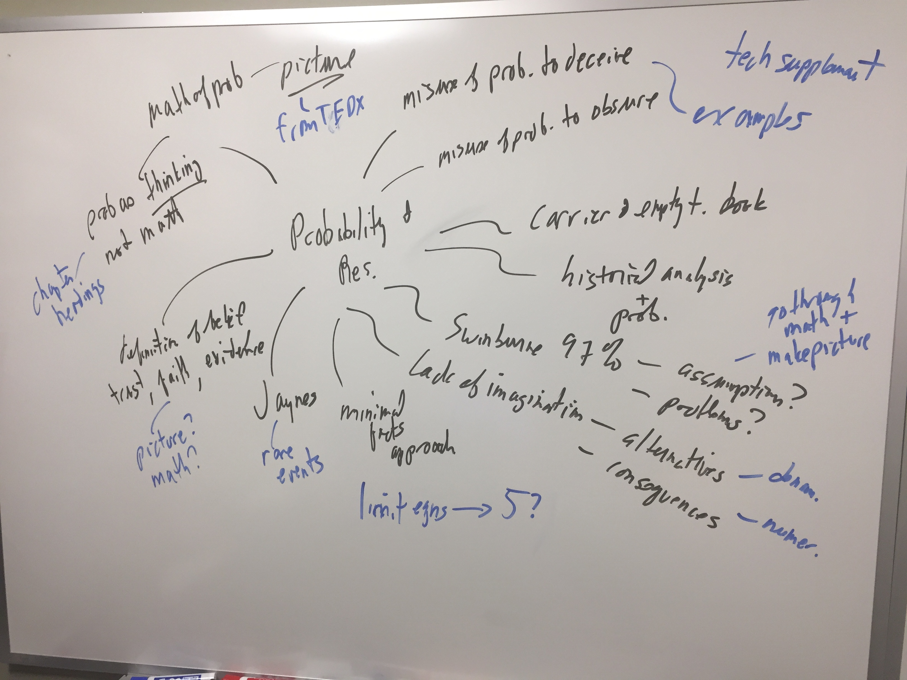

Swinburne reiterates his argument for simplicity, which we dealt with last chapter.  He spells out the historical evidence he is considering,

> The detailed historical evidence, consisting of a conjunction of three pieces of evidence
>
> 1. the evidence of the life of Jesus 
> 2. the detailed historical evidence relating to the Resurrection
> 3. the evidence that neither the prior nor the posterior requirements for being God Incarnate were satisfied in any prophet in human history in any way comparably with the way in which they were satisfied in Jesus. 

and breaks up his hypotheses into pieces,

> - $h_1$: the hypothesis that God became incarnate in Jesus
> - $h_2$: the hypothesis that Jesus rose from the dead. 

> - 
> - h is
>   theconjunction(h1 &h2).NowattheendofthedaythisbookisinterestedinP(h|e&k)--theprobabilitythatJesus
>   was God Incarnate who rose from the dead (h), on the evidence both of natural theology (k) and of the detailed history
>   of Jesus and of other human prophets (e).

Note - only considering positive evidence, not negative.  imagination - seen by cultures around the world?  what about the things we do see that are unlikely if there is a God?  or things we don't see which would be likely if a God?

> 
>
> 
>
> As we go along, I shall suggest numerical values for various probabilities, to be understood as very
> rough values, middle values out of a considerable range of possible values, based on the arguments of the rest of the
> book that certain probabilities are high, or low. 
>
> Let us represent by t theism, the claim that there is a God of the traditional kind. P(t|k) is the probability that there is
> such a God on the evidence of natural theology. I suggested in Chapter 1 that we give this the modest value of $1/2$.
> Then let us represent by c the claim that God became incarnate among humans at some time with a divided
> incarnation, a more precise form of the way described by the Council of Chalcedon.  I suggested that it was 'as probable as not' that he
> would do this and so in numerical terms the probability of his doing it is $1/2$. 
>
> P(c|k) = P(c|t & k) P(t|k). Given my suggested values,
> that is $1/2$ × $1/2$, P(c|k) = 1⁄4.
>
> Now,initially,insteadofe1,e2 ande3,letustakethesightlydifferentf1,f2,andf3.f1 istheclaimthatthereisevidenceofthe
> strength that, Iclaimed in Part II, there is with respect to Jesus, that the prior requirements for being God Incarnate are satisfied in
> oneunnamedprophet.(f1 iscompatiblewithevenmoreevidencethanthereiswithrespecttoJesusthatoneofthe
> requirements is satisfied, and less evidence that some other requirement is satisfied.) f2 is the claim that there is
> evidence of the strength that, I claimed in Part III, there is with respect to Jesus, that the posterior requirements are
> satisfiedwithrespecttothesameprophet(thatis,thathislifewasculminatedbyasuper-miracle).f3 istheclaimthat
> there is evidence (of the strength of e3) that neither set of requirements is satisfied with respect to any other prophet in
> human history in any way comparable to the way they are in the unnamed prophet. Now if c is true, if there occurs an
> incarnation,howprobableisitthattherewillbeevidencef,theconjunction(f1 &f2 &f3)?

I think this is the point - we have *claims* for these.

> if
> God becomes incarnate (given the state of humanity), his reasons for doing so are such that one would expect there to
> be a holy prophet who lives a perfect human life, gives good moral teaching, heals, shows that he believes himself to be
> God Incarnate, claims that that life provides a means of atonement, and founds a Church (with the Church continuing
> the prophet's teaching including the teaching that the prophet was God Incarnate and provided atonement for human
> sins); or at any rate one would expect there to be a prophet who does almost all of these things. 

Note - why not glowing skin, or invincibility, or flying?  

> if God becomes incarnate, there is no obvious reason to
> supposethathewouldbecomeincarnatemorethanonce.

what about more exposure?  so much of this seems post-hoc, unimaginative, and not testable.

> It is simply not possible to investigate whether Jesus rose from the dead without taking a view about how probable it is
> that there is a God likely to intervene in human history in this kind of way. 

Note - why can't there be evidence for the event (e.g. a body seen after death) without knowing the cause?  same w/ faith healing.

- $t$: theism is true - there is a God (of the traditional kind)

- $k$: background knowledge of natural theology

- $P(t|k)$: probability there is a God (of the traditional kind) given the background knowledge of natural theology.  He suggests (from Chapter 1) a ''modest'' value of

- $$
  P(t|k) = 1/2
  $$

- $c$: the claim God became incarnate at some time

- $P(c|t,k)$: probability that "*God became incarnate at some time*" given that "*there is a God (of the traditional kind)*" and "*the background knowledge of natural theology*"  Again, from (Chapter 2) he suggests a "*modest*" value of

- $$
  P(c|t,k) = 1/2
  $$

- $P(c|k)$: probability that "*some God became incarnate at some time*" given "*the background knowledge of natural theology*".  Mathematically it is related to the other terms as

- $$
  P(c|k)= P(c|t,k) \times P(t|k) = 1/2\times 1/2 = 1/4
  $$

- $e$: historical evidence, broken up into

  - $e_{1}$: evidence of the life of Jesus (Part II)
  - $e_{2}$: evidence of the detailed history of the Resurrection (Part III)
  - $e_{3}$: evidence that Jesus satisfies the requirements for divine incarnation more than other prophets (Chapter 3)

- $f$: *claims* that the evidence of the strength given by $e$ (also broken up into $f_{1}$, $f_{2}$, and $f_{3}$

- $P(c|f,k)$: the probability of the incarnate God, given the evidence.  This is the term that Swinburne is ultimately interested in.  His final result is the following, but we'll see how he gets there as we continue.

- $$
  P(c|f,k) = \frac{100}{103} = 0.97
  $$

- $P(f|c,k)$: the probability that, if God became incarnate, we would have the evidence we have.  Swinburne suggests the ''fairly low'' number of $P(f|c,k) = 1/10$, so 

- $$
  P(f \& c|k) = P(f|c \& k)P(c|k) = \frac{1}{10}\cdot\frac{1}{4} = \frac{1}{40}
  $$

- $P(f|k)$: the probability, given $k$, that there is a God who becomes incarnate and leaves evidence of kind $f$ plus the probability, given $k$, that either there is no God or he does not become incarnate and you still have $f$.

- $$
  \begin{aligned}
  P(f|k) &=P(f \& c|k) + P(f \& \sim\!\!c|k)\\
  &=P(f|c \& k)P(c|k) + P(f|\sim\!\!c \& k)P(\sim\!\!c|k)
  \end{aligned}
  $$

  since $P(c|k) = \frac{1}{4}$ we get $P(\sim\!\!c|k) = \frac{3}{4}$. 

- $P(f|\sim\!\!c \& k)$: probability that if there is no incarnation (either because there is no God or he does not become incarnate) and yet there is the evidence of natural theology, $f$ still occurs. Say, 

- $$
  P(f|\sim\!\!c \& k) = \frac{1}{1000}
  $$

  which yields
  $$
  \begin{aligned}
  P(f|k) &=P(f|c \& k)P(c|k) + P(f|\sim\!\!c \& k)P(\sim\!\!c|k) \\
  &= \frac{1}{10}\cdot\frac{1}{4} + \frac{1}{1000}\cdot\frac{3}{4}\\
  &=\frac{103}{4000}
  \end{aligned}
  $$
  and
  $$
  P(c|f\&k)=\frac{P(f|c\&k)P(c|k)}{P(f|k)} = \frac{\frac{1}{10}\cdot\frac{1}{4}}{\frac{103}{4000}} = \frac{100}{103}
  $$

> This represents the probability on the strength of evidence about some prophet that we have about Jesus, that God has or will become incarnate. But, now our evidence
> is somewhat greater than f. It is the evidence e that the prophet whom f concerns is Jesus, and that the detailed evidence
> (of the given strength) relevant to the satisfaction of the prior and posterior requirements is as it is. It cannot make any
> difference to the probability that f (with k) gives to c, if we add to f who the prophet is, and the details of the evidence,
> since we have already taken account in f its strength in supporting c. So,

$$
P(c|e\&k)= P(c|f\&k) = \frac{100}{103}
$$

> We
> cannot seriously suppose that although God plans to become incarnate in order to live the sort of life which, as far as
> our evidence shows, Jesus did, and which would be culminated by the sort of super-miracle which, as far as our
> evidence shows, was the life of Jesus, yet it was not in Jesus but in some other prophet that God will become incarnate.
> That indeed would be a grand deception by God. So, P(h|e & k) will not be very different from P(c|e & k). So let's say
> P(h|e & k) equals something like 0.97. In other words our total evidence (e & k) makes it very probable indeed that
> God became incarnate in Jesus Christ who rose from the dead.

\appendix

# Miscellaneous

## Alternative titles

* A Measure of Faith
* Reason, Religion, and the World Around Us
* Counting On God - The Mathematics of Religious Thought

### Mind Map for the Resurrection

